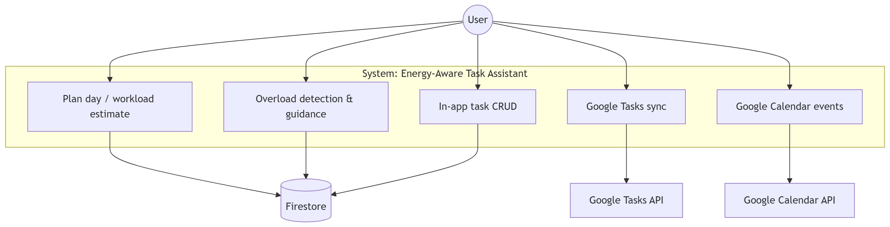
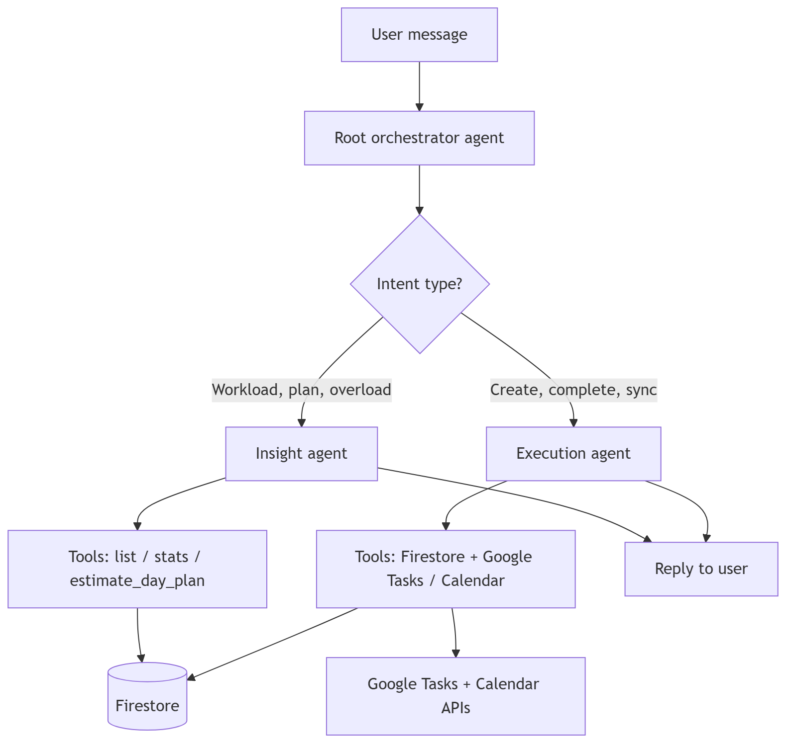

# ⚡ Energy-Aware AI Task Manager

> AI that learns your work pace, detects overload early, and helps plan sustainably.

## What This Project Does

This project is a multi-agent assistant for daily task planning and execution.

- Learns behavior-based task duration trends
- Flags overload risk before burnout
- Supports in-app task planning and Google Tasks/Calendar actions

## Why It Matters

Most planning tools optimize for task count, not human energy.  
This assistant is **energy-aware**: it estimates realistic capacity and helps users rebalance work before they overcommit.

## Core Capabilities

- **Multi-agent orchestration**: root agent routes to insight/execution agents
- **Behavioral time modeling**: estimates workload from completion history
- **Overload detection**: identifies when planned effort exceeds available time
- **Task operations**: create/list/complete tasks
- **Google integrations**: create/update/list Google Tasks and Calendar events

## High-Level Architecture

- **Root Agent**: intent routing and concise responses
- **Insight Agent**: workload analysis, recap, and planning suggestions
- **Execution Agent**: task/calendar actions with safe tool handling
- **Data Layer**: Firestore for app tasks and user stats

### Use-Case View



### Process Flow View



## Public API (Quick Test)

Base URL example:

`https://energy-aware-ai-assistant-5736820628.asia-northeast3.run.app`

### 1) Health

```bash
curl -sS "$BASE_URL/health"
```

### 2) List tasks

```bash
curl -sS "$BASE_URL/task?limit=5" \
  -H "X-User-Id: beta-user-1" \
  -H "X-Session-Id: local-session-1"
```

### 3) Plan day

```bash
curl -sS -X POST "$BASE_URL/plan" \
  -H "Content-Type: application/json" \
  -H "X-User-Id: beta-user-1" \
  -d '{"total_available_time_minutes":360}'
```

### 4) Create task

```bash
curl -sS -X POST "$BASE_URL/task" \
  -H "Content-Type: application/json" \
  -H "X-User-Id: beta-user-1" \
  -H "X-Session-Id: local-session-1" \
  -d '{"title":"Cloud Run smoke task","category":"admin","priority":"medium","estimated_minutes":20}'
```

## Pitch Materials

See [`pitch/`](pitch/) for:

- problem/solution summary
- USP and differentiators
- tech stack
- use-case/process diagrams

## Internal / Developer Docs

All internal setup and operational docs are indexed in [`doc/`](doc/README.md).
