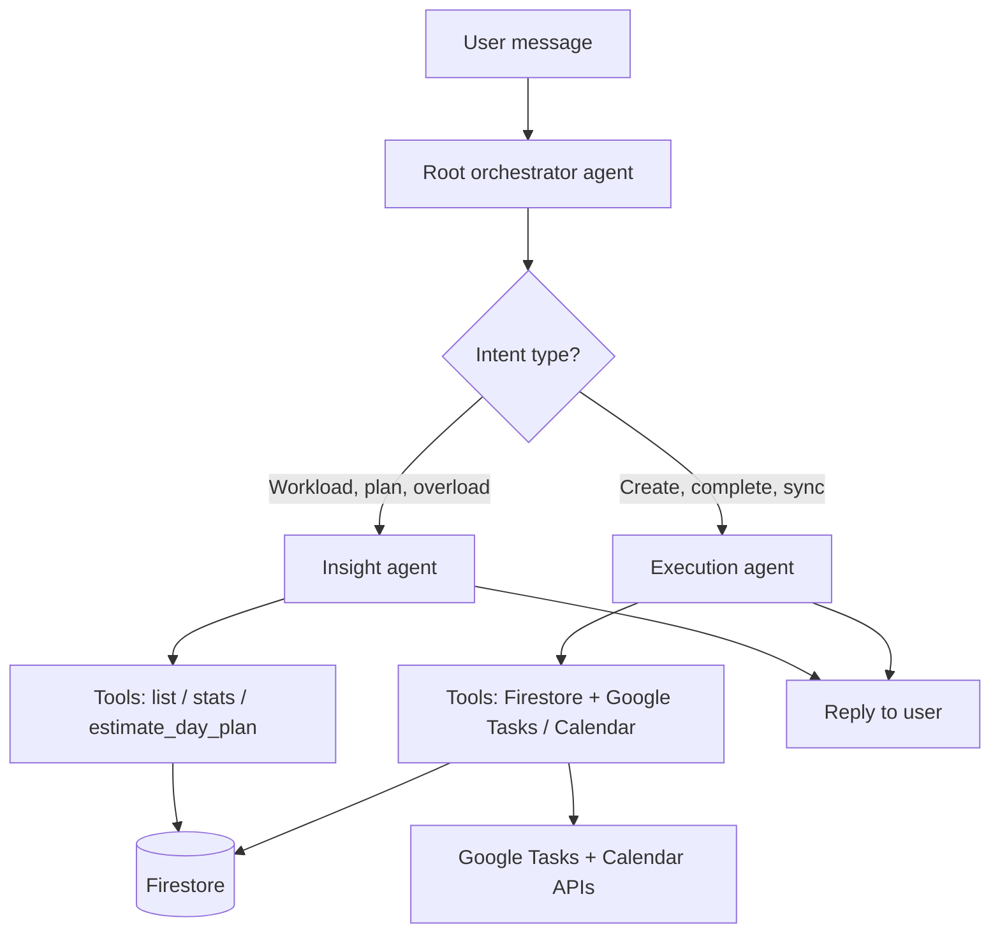
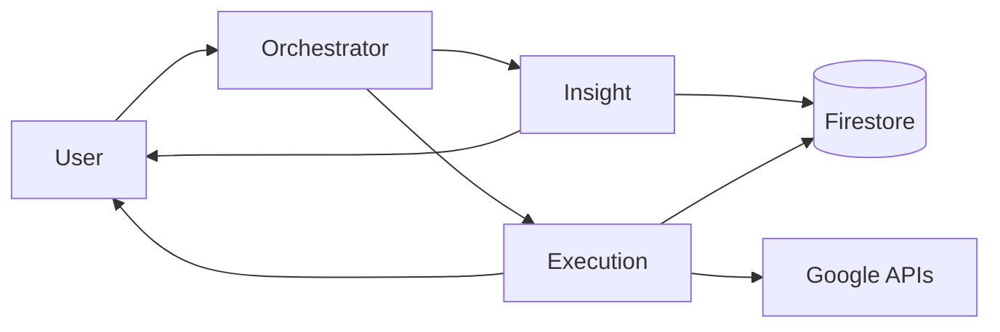

# Process flow (concise happy path)

Single end-to-end view: classify intent → right agent → tools → stores → reply.

```mermaid
flowchart TD
    U[User message]
    R[Root orchestrator agent]
    D{Intent type?}
    I[Insight agent]
    E[Execution agent]
    TI[Tools: list / stats / estimate_day_plan]
    TE[Tools: Firestore + Google Tasks / Calendar]
    FS[(Firestore)]
    GG[Google Tasks + Calendar APIs]
    OUT[Reply to user]

    U --> R
    R --> D
    D -->|Workload, plan, overload| I
    D -->|Create, complete, sync| E
    I --> TI
    TI --> FS
    I --> OUT
    E --> TE
    TE --> FS
    TE --> GG
    E --> OUT
```

**Shorter variant** (one slide, minimal nodes):

```mermaid
flowchart LR
    U[User] --> O[Orchestrator]
    O --> I[Insight]
    O --> X[Execution]
    I --> F[(Firestore)]
    X --> F
    X --> G[Google APIs]
    I --> U
    X --> U
```
