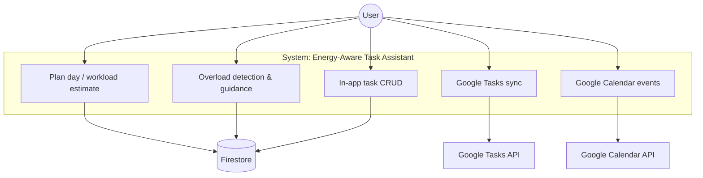

# Use-case diagram (concise)

**Actor:** User. **Secondary systems:** Firestore, Google Tasks API, Google Calendar API.

**Note:** UC1–UC3 lean on Firestore for tasks and stats; UC4–UC5 call Google APIs after OAuth.
